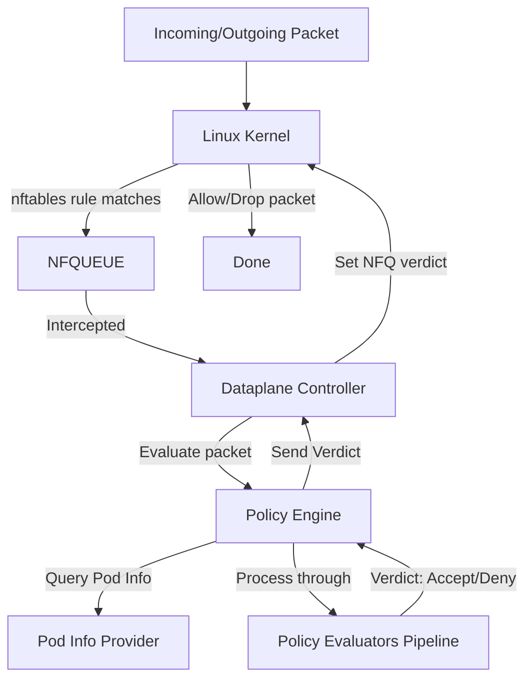
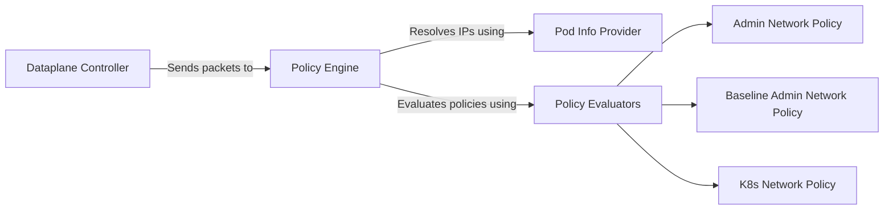

The `kube-network-policies` project is designed to enforce Kubernetes network policies by intercepting and evaluating network packets in userspace. This is achieved by using `NFQUEUE` to redirect packets to the controller, which then decides whether to allow or deny them based on a pipeline of policy evaluators.

## Packet Flow

The following diagram illustrates the flow of a network packet from the Linux kernel to the userspace controller and back:

To avoid the performance penalty of sending all packets to userspace, the controller includes logic to only capture packets for pods that are targeted by at least one network policy.

## Key Components

The architecture consists of several key components working together:

* **Dataplane Controller** (`dataplane/controller.go`): The main controller that sets up NFQUEUE, intercepts packets, and orchestrates the policy evaluation process. It creates the necessary nftables rules to redirect traffic.
* **Policy Engine** (`networkpolicy/engine.go`): Manages a pipeline of `PolicyEvaluator` plugins. The engine runs each packet through the pipeline and makes a final decision based on the verdicts returned by the evaluators.
* **Pod Info Provider** (`podinfo/podinfo.go`): Provides an interface for retrieving pod information. It resolves a packet's IP address to a `PodInfo` object containing all necessary labels, namespaces, and node info.
* **Policy Evaluators**: Plugins implementing the `PolicyEvaluator` interface that contain the logic for a specific type of network policy.
